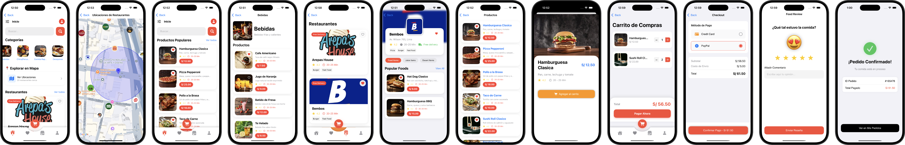

<div align="center">
    
  
  <br />
  
  <h1 align="center">Ecommerce EaToo Swift</h1>

  <p align="center">
    <strong>Food Delivery Experience. Redefined.</strong>
    <br />
    Aplicación nativa iOS desarrollada con SwiftUI y Clean Architecture.
    <br />
    <br />
    <a href="PEGAR_TU_LINK_DEL_VIDEO_AQUI">Ver Demo</a>
    ·
    <a href="#funcionalidades">Funcionalidades</a>
    ·
    <a href="#instalacion">Instalación</a>
  </p>

  <p align="center">
    
    
    
    
  </p>
</div>

<br />

<div align="center">
  
</div>

<br />

##  Sobre el Proyecto

**EaToo** es una aplicación de delivery móvil moderna y robusta. Construida enteramente en **SwiftUI**, la app demuestra el uso profesional del patrón **MVVM**, concurrencia estructurada (`async/await`) y geolocalización avanzada.

La aplicación funciona como un cliente "Full Stack", consumiendo una **API RESTful propia** alojada en servidores de Alwaysdata, lo que permite gestionar usuarios, restaurantes, pedidos y menús dinámicos en tiempo real.

---

<h2 id="funcionalidades">✨ Funcionalidades Principales</h2>

### 📍 Experiencia de Geolocalización
Integración profunda con **Google Maps SDK (v10.6.0)** para ofrecer una experiencia visual inmersiva:
* **Radar de Proximidad:** Visualización de radio de alcance de 500m mediante `GMSCircle`.
* **Marcadores Dinámicos:** Los pines del mapa se renderizan en tiempo real mostrando la foto de cada restaurante usando `UIGraphicsImageRenderer`.
* **Rastreo en Vivo:** Seguimiento preciso de la ubicación del usuario mediante `CoreLocation`.

### 🛍️ Gestión de Pedidos & E-Commerce
* **Carrito Inteligente:** Lógica de negocio local (`GestorCarrito`) para calcular totales, impuestos y validar items.
* **Persistencia Híbrida:** Uso de `UserDefaults` para historial local rápido y sincronización con base de datos remota MySQL para seguridad.
* **Checkout Flow:** Pasarela de pago simulada con validación de métodos y confirmación de órdenes.

### 🔐 Panel Administrativo (CMS Móvil)
Un sistema de gestión de contenido completo integrado en la propia app:
* **CRUD Completo:** Crear, leer, actualizar y eliminar restaurantes y productos.
* **Gestión de Usuarios:** Administración de perfiles y permisos directamente desde la interfaz móvil.
* **Networking Asíncrono:** Todas las operaciones de escritura utilizan `async/await` con `URLSession` para una experiencia fluida sin bloqueos.

---

## 🛠️ Especificaciones Técnicas

### Arquitectura & Diseño
El proyecto sigue una arquitectura **MVVM (Model-View-ViewModel)** estricta para separar la lógica de negocio de la interfaz de usuario, facilitando la escalabilidad y el testing.

* **Tipografía:** Sistema de fuentes personalizado utilizando la familia **Inter** (Regular, Bold, Light) inyectado globalmente vía `EnvironmentValues`.
* **UI Components:** Uso de `ViewModifier` personalizados para estandarizar botones (`PillButton`) y tarjetas.

### Stack Tecnológico
| Componente | Tecnología | Descripción |
| :--- | :--- | :--- |
| **Mobile Client** | SwiftUI 3 / Swift 5 | Desarrollo 100% nativo. |
| **Maps Engine** | Google Maps SDK | Versión 10.6.0 gestionada vía SPM. |
| **Backend** | PHP 8 / MySQL | API REST hospedada en *alwaysdata.net*. |
| **Networking** | URLSession | Peticiones `multipart/form-data` y decodificación JSON (`Codable`). |

---

<h2 id="instalacion">🚀 Instalación y Despliegue</h2>

Sigue estos pasos para ejecutar el proyecto en tu entorno local (macOS).

### Prerrequisitos
* Xcode 13.0+
* iOS 15.0+

### Pasos

1.  **Clonar el repositorio**
    ```bash
    git clone [https://github.com/tu-usuario/EaToo.git](https://github.com/tu-usuario/EaToo.git)
    ```

2.  **Abrir el Proyecto**
    Abre el archivo `EaToo.xcodeproj`. Xcode comenzará automáticamente a resolver los paquetes Swift (Google Maps SDK).

3.  **Configuración de API Key**
    Para que los mapas carguen correctamente, debes añadir tu propia API Key en `AppDelegate.swift`.
    ```swift
    // Ubicación: EaToo/Api/AppDelegate.swift
    GMSServices.provideAPIKey("TU_GOOGLE_MAPS_API_KEY")
    ```

4.  **Compilar y Ejecutar**
    Selecciona un simulador (ej. iPhone 14 Pro) y presiona `Cmd + R`.

---

<div align="center">
  
  <p>Diseño basado en el estudio UI/UX:</p>
  <a href="https://www.behance.net/gallery/229420607/Food-Delivery-App-UIUX-Case-Study">Food Delivery App UI/UX Case Study</a> 
</div>
